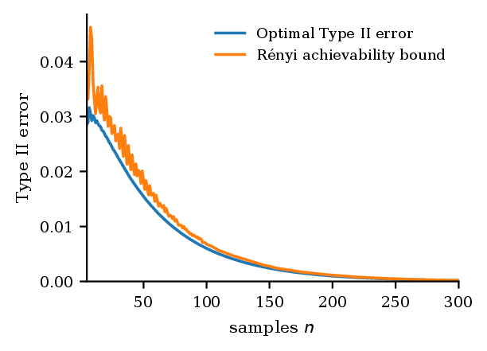
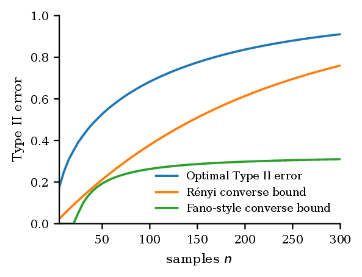

# Finite Sample Bounds for Composite Hypothesis Testing

[](https://arxiv.org/abs/2608.28068)
[](https://doi.org/10.48550/arXiv.2608.28068)

Companion repository for **“Finite Sample Bounds for Composite Hypothesis Testing”** by Elías Vera-Sigüenza and Amedeo Roberto Esposito.

The paper studies finite-sample binary hypothesis testing when both the null and alternative are composite. Rényi-divergence bounds provide explicit achievability and converse guarantees, identify the phase transition under an exponentially decaying Type I constraint, and recover exact exponents for compact convex full-support classes on finite alphabets.

## Main results

- A finite-sample Rényi converse obtained by pairwise reduction, without assuming a least-favourable pair.
- A single uniformly valid test built from a joint Rényi projection for orders $0<\lambda<1$.
- A phase transition at

  $$
  r_{\mathrm c}=\inf_{Q\in\mathcal C_1}\inf_{P\in\mathcal C_0}D(Q\|P).
  $$

- Exact achievable and strong-converse exponents on finite alphabets, together with a polynomial refinement and conditions for finite-sample least favourability.

## Finite-sample illustration

The README previews `Figure_1.eps` and `Figure_2.eps` from the paper source. Together they form the paper's first figure for nonordered affine ternary classes under $\varepsilon=e^{-nr}$: the left panel is below the transition at $r=0.35D(\mathcal C_1\|\mathcal C_0)$, while the right panel is above it at $r=1.5D(\mathcal C_1\|\mathcal C_0)$.

<p align="center">
  
  
</p>

## Repository layout

- [`paper/`](paper/) — arXiv v2 LaTeX source, bibliography, all five EPS figures, and the arXiv PDF.
- [`numerics/`](numerics/) — numerical scripts, saved data, figures, and validation artefacts from the research workflow.
- [`assets/`](assets/) — PNG previews used in this README.

## Build the manuscript

A full TeX Live installation with `IEEEtran`, BibTeX, and EPS conversion support is recommended.

```bash
cd paper
latexmk -pdf -shell-escape manuscript.tex
```

The current arXiv version is available directly as [`paper/Manuscript.pdf`](paper/Manuscript.pdf).

## Citation

```bibtex
@misc{vera_siguenza_2026_finite_sample,
  title         = {Finite Sample Bounds for Composite Hypothesis Testing},
  author        = {Vera-Sig\"uenza, El\'ias and Esposito, Amedeo Roberto},
  year          = {2026},
  eprint        = {2608.28068},
  archivePrefix = {arXiv},
  primaryClass  = {cs.IT},
  doi           = {10.48550/arXiv.2608.28068}
}
```

Citation metadata are also provided in [`CITATION.cff`](CITATION.cff).

## License

The arXiv manuscript is distributed under the [Creative Commons Attribution 4.0 International license](https://creativecommons.org/licenses/by/4.0/). No separate software license is asserted here for the numerical code.
